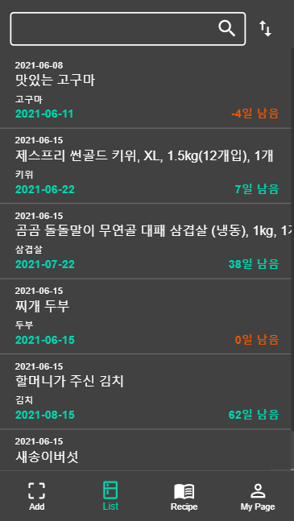
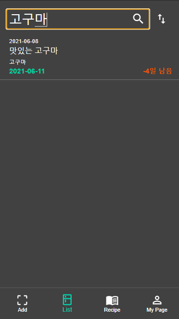
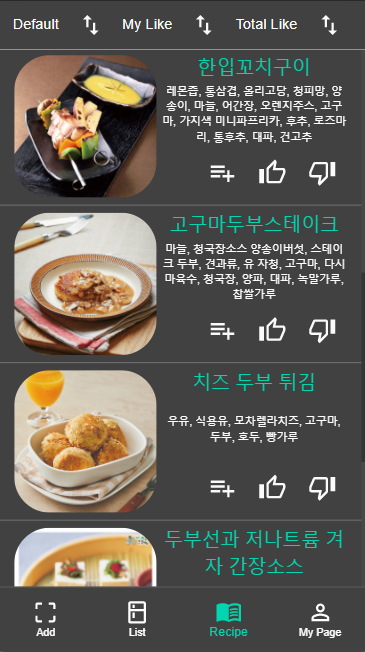
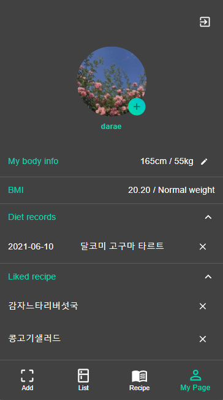

# Food Manager
2021 서울시립대학교 졸업설계프로젝트

기획 및 개발기간: 2021.03 ~ 2021.06 (약 4개월)

## 요약
스마트 냉장고의 **유통기한 관리, 레시피 추천** 기능을 탈부착식 하드웨어에서 구현하여, 편리하고 저렴한 제품을 개발하였습니다.

## 기능
### 1. 식재료 등록 및 관리
- 직접 문자열로 입력하거나 바코드 사진을 올려서 식재료 입력 (바코드는 현재 임시 데이터로만 작동 가능)
- 시중 제품명을 입력하더라도 재료 DB 의 재료와 매칭
```
"제스프리 썬골드 키위, XL, 1.5kg(12개입), 1개" --> "키위"
```
- 사용자의 식재료 리스트에서 원하는 식재료를 검색하여 볼 수 있음
- 유통기한이 임박한 순서대로 정렬 가능
- 식재료의 정보 수정 가능





### 2. 레시피 추천
- 사용자의 재료를 바탕으로 레시피 추천
- 좋아요/싫어요
- 식단기록 추가
- 레시피 총 좋아요 갯수 별로 정렬
- 레시피 클릭 시, 유튜브에서 해당 레시피 검색



### 3. 마이페이지
- 프로필 사진, 키, 몸무게 표시 및 수정
- 식단기록에 저장한 레시피 표시
- 좋아요를 누른 레시피 표시



## 기술 설명
### Frontend
- React.js & React Hooks
- Material UI
- Typescript
- Quagga JS

### Backend
- Node.js
- Python
- MariaDB

### Recommender System
- 레시피 임베딩 생성 시 주재료에 가중치(주재료일 수록 높음)
- 사용자 임베딩에는 유통기한 가중치(임박할 수록 높음)
- 유사도 함수로 계산 후 상위 N개 레시피 반환

### Hardware
- Raspberry Pi
- Lineage OS
