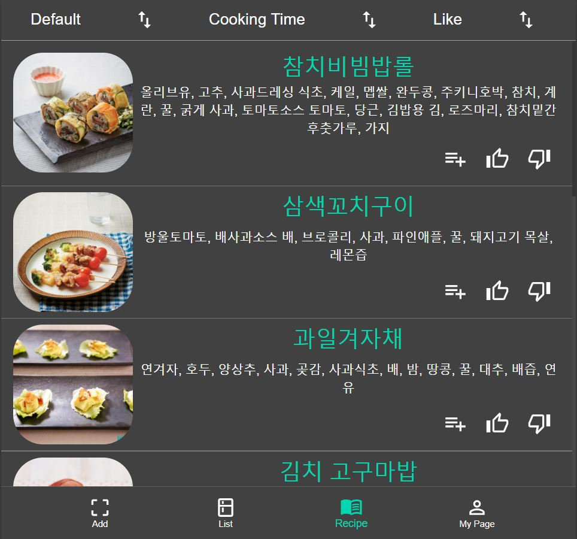

# UOS Food Manager fronted



## demo

<https://food-manager.ga/>

## folder

-   📁 frontend
    -   📁 public => images, icons
    -   📁 src
        -   📁 components
            -   📁 pages => page files
            -   📁 public => public component files
            -   📄 Main.tsx => route component
            -   📄 BottomNavBar.tsx => footer Layout
            -   📄 Model.tsx => State Model
            -   📄 Provider.tsx => Binder
            -   📄 index.js => module export
        -   📁 scss => scss style files
        -   📄 App.tsx => root page

## tech

react hook, context api, typescript, quagga js(Barcode)

## How to start

```sh
npm install
npm start
```
